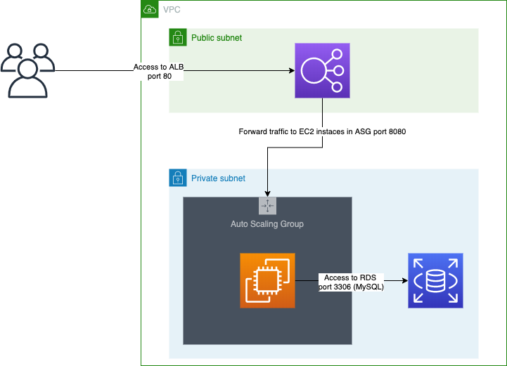

# Exp App

## Assumptions

The current infrastructure has been configured to host applications of type Spring MVC or similar, where the controllers will access directly the Database.

## Folder structure

```bash
├── img
├── infra-live                  -> Terragrunt environments for the infrastructure
│   └── dev
│       ├── asg-tomcat
│       ├── rds
│       └── vpc
├── infra-modules               -> Terraform modules to set up the infrastructure
│   ├── asg-tomcat
│   ├── rds
│   └── vpc
├── tomcat-ansible              -> Ansible playbook to set up Tomcat server
│   └── roles
│       └── tomcat
│           ├── files
│           ├── tasks
│           └── templates
└── tomcat-packer               -> Packer template to create the Tomcat AMI
```

## Diagram



## Steps to create the Tomcat AMI

### Prerequisites

1. Packer   >= 1.5.6
2. Ansible  >= 2.9.7
3. Python   >= 3.7.5

### Steps

1. Export env variables required by Packer
    ```
    export AWS_REGION=''
    export AWS_SUBNET_ID=''
    export AMI_NAME=''
    export AWS_ACCESS_KEY_ID=''
    export AWS_SECRET_ACCESS_KEY=''
    export TOMCAT_MANAGER_PASSWD=''
    export TOMCAT_DEPLOYER_PASSWD=''
    ```
2. Navigate to Packer folder
    ```
    cd tomcat-packer/
    ```
3. Validate Packer template
    ```
    packer validate centos-7.json
    ```
4. Build Packer template
    ```
    packer build centos-7.json
    ```

## Steps to provision the Infrastructure

### Prerequisites

1. Terraform >= v0.12.24
2. Terragrunt >= v0.23.8

### Why Terragrunt ?

1. Keep Terraform code and remote state configuration DRY
2. Before and After hooks
3. Promote code using git tags
4. Create a good code structure 
 
### Steps

1. Export env variables required by Terraform
    ```
    export AWS_REGION=''
    export AWS_ACCESS_KEY_ID=''
    export AWS_SECRET_ACCESS_KEY=''
    export TF_VAR_username=''
    export TF_VAR_password=''
    export TF_VAR_ami=''
    ```
2. Navigate to Live Infrastructure folder
    ```
    cd infra-live/
    ```
3. Navigate to Infrastructure Environment
    ```
    cd dev/
    ```
4. Plan and Apply VPC infrastructure module
    ```
    cd vpc/
    terragrunt plan
    terragrunt apply
    ```
5. Plan and Apply ASG Tomcat infrastructure module
    ```
    cd asg-tomcat/
    terragrunt plan
    terragrunt apply
    ```
6. Plan and Apply RDS infrastructure module
    ```
    cd rds/
    terragrunt plan
    terragrunt apply
    ```